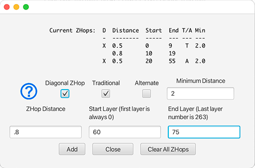
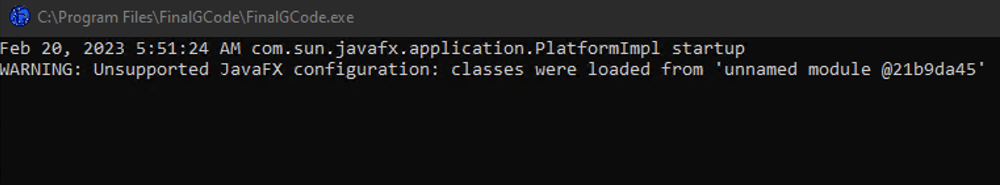

# Final GCode
Final GCode is a program that I wrote for doing some gcode modifications that I could not get done in my slicer. I wrote the program for my own needs, but thought maybe some of the features would be of use to others, so I published it here.

### Features

- Add ZHop to
  - A Single layer
  - Multiple single layers
  - A range of layers 
  - Multiple ranges of layers
- Diagonal ZHopping
- Gradual bed cooling
  - Set a time frame for the print to start gradually cooling the bed so that the print is removable as soon as it's done.
- Interim hot end heating
  - Set a temp for the hot end to hold at while the bed is heating so that the hot end doesn't ooze filament while waiting for the bed to heat
  - Optionally set an interim bed temp so that when it is reached, the bed temp continues to climb to its print temp at the same time the hot end continues to rise from its hold temp. When set properly, they will both reach print temp at the same time.
- Home hot end at beginning of print
- Change bed temp at one specified layer
- Add custom finishing gcode
- Slider that lets you slide through the layers which will give you:
  - Print time up to that layer
  - Remaining print time from that layer
  - Model height at that layer
  - Remaining model height left to print from that layer
  - This tool gives you info that can help you figure out where you want to set the other settings.

The program is intended to be used as the Prusa Slicer finishing gcode processor, by adding it to your Prusa settings. However, you can also use it manually by executing the program and passing into the executable, the full path to your gcode file as an argument.


### Time Calculations
For some reason, the way that time is calculated from gcode doesn't seem to work properly with Cura sliced gcode. I'm working on this ... but if you slice with Prusa, the time calculation should be accurate.

## Using Final GCode

The best way to use the program is to go to the [Releases link](https://github.com/EasyG0ing1/FinalGCode/releases/latest) on the right and download either the Windows or Mac version as you need. Then you simply run the program and if you didn't pass in the gcode file as a command line argument, it will start out with an open file dialoge that you can use to get your gcode file.

All of the Java libraries are self contained within the compiled program so no need to install Java.

Your gcode ***MUST*** have layer markers in it that look like this
```gcode
;LAYER:12
```
The way I have this set up in Prusa is by going into `Printer Settings` then click on `Custom G-Code` then in `Before layer change G-Code`
```gcode
;LAYER:[layer_num], Z HEIGHT:[layer_z]
```
If you want the program to include the height of the model, your slicer should have `Z HEIGHT:` at the beginning of each layer.

If you open a gcode file and it says there are 0 layers and the slider bar has no slider control on it, then your gcode doesn't have the layer markers in it.

#### Prusa Slicer Final GCode Processing
In order to use this program as the post processing software in PrusaSlicer, there are some settings you will need to make in Prusa. 

If you're using Windows, skip ahead a little to Prusa For Windows.

## Prusa for MacOS
After installing the program, you will need to create a small bash shell script that will have two lines in it. Here is an example that should help you figure out what your script needs to look like:

```Bash
export JAVA_HOME="/Applications/FinalGCode.app/Contents/Resources/javafx-sdk-19.0.2.1"
/Applications/FinalGCode.app/Contents/MacOS/universalJavaApplicationStub $1
```
Save this using any filename you want as long as its extension is `.sh` for example `PrusaPostProcessing.sh` Then from inside terminal you need to give the script execution rights by doing this
```Bash
chmod +x PrusaPostProcessing.sh
```

Then within Prusa, you need to go into `Print Settings` / `Output Options` `Post processing scripts` and put in the full path to that `.sh` file

```bash
/Users/username/PrusaPostProcessing.sh
```
---
## Prusa For Windows
To set up the program to automatically receive any gcode from Prusa in Windows, you will first need to know what the path is to the .exe. This is normally `C:\Program Files\FinalGCode\FinalGCode.exe`

Open PrusaSlicer and go into `Print Settings` / `Output Options` `Post processing scripts` and put in the full path to the .exe file surrounded by quotes (quotes are necessary if there is a space character in the path).

```agsl
"C:\Program Files\FinalGCode\FinalGCode.exe"
```
---


And thats it! Now, when you export your gcode from within Prusa, it will send the gcode to this program and the window will pop up where you can make your changes and then save the final gcode.

If you use Prusa to upload your gcode to Octo Print, it will use the modified gcode to send to the server.

## Main Window


Everything is optional and the different options are enabled by selecting that options check box.

Filament is essentially a `Settings` option. The program stores the values that you enter in all of the fields so that they persist between reloads, **except for zHop settings**. When you use the program from Prusa Slicer, Prusa sends the program various information, including which filament is being used for the print. At the moment, I only have it set up to detect PLA or ABS since those are what I use the most, but I will be adding the ability for it to detect any filament that is sent to it, at which point it will use whatever is sent as an additional settings slot so that your values for any filament persist between reloads.

It made the most sense to me that things like hot end temp and bed temp would be different based on what filament is being used so then using the filament title as a settings slot seemed logical.

If you hover your mouse and hold it still over any of the text boxes, you will get tooltip information that explains what that setting does, but the break down goes like this:

#### Hold Hot End...
- `Hold` - The temp to hold the hot end at while the bed heats.
- `Print` - The temp the hot end needs to be at when printing starts.
- `Bed Hold` - When the bed reaches this temp, then it will set both the hot end and the bed to their final temps. When set properly, the hot end and the bed will reach print temp at the same time.
- `Bed Print` - The temp at which the bed needs to be at before the print starts.

#### Set bed temp...
- `New Temp` - This lets you change the bed temp at any layer in the print.
- `Layer` - This is the layer at which to apply the setting from New Temp.
- This can be handy if you want the bed temp to be hotter during the first few layers, then have it cool down a little for the remaining print so that it wont keep the material too soft.

#### Fade bed temp...
- `Final Temp` - This is the temp that you want the bed to be at when the print is done.
- `Time` - This is how long you want the bed temp to fade out. So if set to 10 for example, the program will figure out how many layers at the end of the print will take 10 minutes then it will add to each relevant layer a single degree drop in bed temp until it has set the value from `Final Temp` 

## ZHopping

Pressing the Add ZHop button brings up a window that lets you add any kind of zHop combinations that you need



DO NOT USE THIS FEATURE IF YOU HAD YOUR SLICER DO ZHOPPING

The form is convenient to use with just a keyboard. You can use tab or enter to jump to the next field and if there is enough information set while the cursor is in `End Layer`, then hitting enter will add those zHop settings to the set and you can see at the top of the form the sets that you have already added.

Pressing tab or enter from a field that does not have valid data in it will cause the cursor to remain in that field until you put something in it.

Leaving the `End Layer` field empty will cause it to use the last layer number in the print as the final layer for those zHop settings.

Pressing escape closes out the form and the zHop settings that are shown at the top of the form are retained for final processing. If you press escape before committing the currently entered values, those values will NOT be added to the set. So either press enter when you've entered in the values you want or press the Add button before pressing escape (or the Close button which does the same thing as pressing escape).

### Diagonal ZHop

Click on the question mark for information about what diagonal ZHop is. Also, there is a [video from Michael](https://www.youtube.com/watch?v=OAXi_apvgl4) on the TeachingTech channel on Youtube that also goes over what it's all about.

### How it works

ZHopping as a concept is simple. You take the current value of Z in the layer, then add to it, the value you set for the ZHop. Then every time the code moves the print head WITHOUT also extruding filament, you insert the zHop before that move, then set Z back to the layers Z value before the next command that extrudes filament.

Implementing this in code is lot more rule intensive, but that is the net result of how the gcode gets modified. This is why it is important to not do this if your slicer already added ZHop to the gcode, because it will have unpredictable results since the code is not designed to look for existing zHopping.

## Processing GCode

When you click on the Process GCode button, it will save the modified gcode in the same folder that the source gcode file is in. Or if you're using this program with Prusa, it will get the path that you chose when you hit the Export GCode button. 

It will ammend the word `Modified` to the end of the gcode filename before the `.gcode` extension.

If you're using Prusa to upload the gcode directly to Octo Print or Klipper etc., the uploaded gcode will be the code that was modified by this program.

---
### Windows Users

You will see a DOS style window pop up that looks like this:



This is normal and the warning that it shows can be ignored. This is a Java thing and is related to how I compile the program to work in Windows. The compiler tools that I use don't currently support Java module code so thats what the warning is all about.

---

### Disclaimer
I make no warranties or guarantees about this software other than it does what has been described. Gcode can be VERY diffrent from one slicer to the next, and it can even be VERY different with different configurations within the same slicer. That being said, there is only one feature of this code that goes through your gcode and makes changes throughout and that is the zHop feature. Other than that, this program only makes changes to the start and the end of your gcode. There SHOULD BE no reason what so ever be concerned with the changes this software makes in your gcode.  

You are expected to be able to look at the changes that this software makes to your gcode and decide for yourself if it's OK to run that gcode on your printer. But I assure you, there is no way that this software could ever cause your printer to do anything outside of what your configuration might be in terms of limit switches etc. No code modifications will ever happen with this software that will cause your printer to ignore those safety nets.

---

If you have any desired changes that you would like to see in this program, open an issue, or submit a pull request. I am more than happy to advance this program and make it even more capable than it is.

I hope you get as much use out of this program as I have.

Thank you,

Mike Sims

sims.mike@gmail.com
